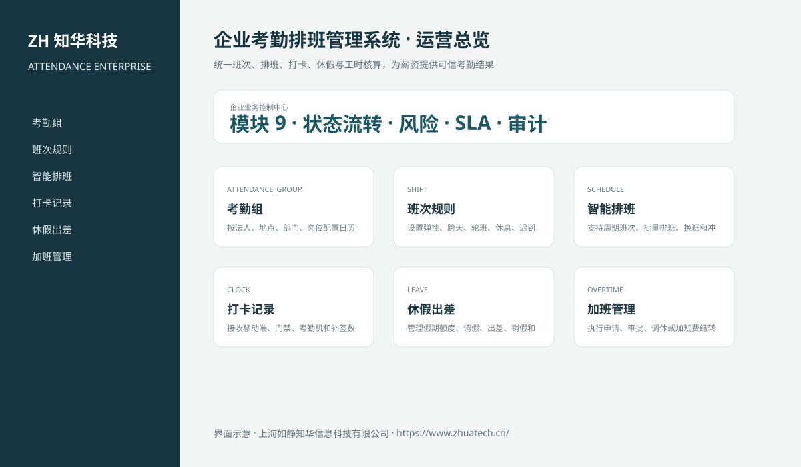

# ZhuaTech ATTENDANCE｜企业考勤排班管理系统

> 统一班次、排班、打卡、休假与工时核算，为薪资提供可信考勤结果

ZhuaTech ATTENDANCE 是知华科技（上海如静知华信息科技有限公司）发布的企业级源码项目，面向“考勤组、班次、排班、打卡、请假、出差、加班、异常、工时、月结与薪资对接”提供管理端与响应式业务端。工程采用前后端分离架构，所有示例数据均为虚构数据。

[知华科技官网](https://www.zhuatech.cn/) · [架构说明](docs/ARCHITECTURE.md) · [API 文档](docs/API.md) · [企业能力](docs/ENTERPRISE.md) · [测试说明](docs/TESTING.md)



## 业务模块

| 模块 | 核心能力 |
| --- | --- |
| 考勤组 | 按法人、地点、部门、岗位配置日历和打卡规则 |
| 班次规则 | 设置弹性、跨天、轮班、休息、迟到和早退规则 |
| 智能排班 | 支持周期班次、批量排班、换班和冲突检查 |
| 打卡记录 | 接收移动端、门禁、考勤机和补签数据 |
| 休假出差 | 管理假期额度、请假、出差、销假和审批结果 |
| 加班管理 | 执行申请、审批、调休或加班费结转 |
| 异常处理 | 闭环缺卡、迟到、早退、跨区和设备异常 |
| 工时核算 | 按项目、成本中心和工作日历汇总有效工时 |
| 考勤月结 | 执行确认、锁定、重开、薪资推送和审计 |


## 本次深化的核心考勤能力

- 独立员工月度考勤台账和幂等考勤流水，区分出勤、假期、加班和异常；
- 月结前强制清零未处理异常，并校验应出勤与实际核算差异；
- 草稿、提交、批准、月结四阶段由服务端状态机保护；
- 经办提交与管理员审批执行职责分离，普通操作员不能审批和月结；
- 月结必须绑定薪资批次号，锁定后禁止继续写入考勤流水；
- 前端新增考勤月结工作台，可完成登记、提交、审批及薪资结转。
- 新增请假与加班申请、管理员审批、拒绝和自动入账流程；
- 禁止通过普通考勤流水绕过假勤审批，申请人与审批人执行职责分离；
- 存在待审批假勤申请时禁止提交月结，期间看板同步统计待审批数量。

## 企业级控制

- ADMIN / OPERATOR 角色边界和管理员接口隔离；
- 服务端字段、模块、唯一编号和状态迁移校验；
- 组织、期间、责任人、风险等级、到期日和 SLA 统计；
- 幂等创建、JPA 乐观锁、重复提交保护和职责分离；
- 附件 SHA-256 元数据、业务凭证完整性与全流程审计；
- 组合检索、分页、逾期筛选、UTF-8 CSV 导出和协作时间线；
- 外部系统仅预留适配器，使用方自行配置地址与凭据；
- prod profile 拒绝默认密码、弱数据库口令和本地跨域来源。

## 技术架构

- 后端：Java 21、Spring Boot、Spring Security、JPA、Bean Validation、Actuator
- 前端：Vue 3、Vite、Axios，支持桌面端与移动端响应式布局
- 数据库：MySQL 8；自动化测试使用 H2
- 交付：Docker Compose、Nginx、环境变量、GitHub Actions
- Java 包名：`cn.zhuatech.attendance`

## 启动与测试

```bash
cd backend && mvn test
cd ../frontend && npm install && npm run build
cd .. && cp .env.example .env && docker compose up --build
```

开发演示账号：`admin / admin123`、`operator / operator123`。生产环境必须通过环境变量替换全部默认凭据。

## 许可与商业授权

Copyright © 2026 上海如静知华信息科技有限公司。

本工程仅允许个人学习、研究和非商业技术交流，**不得用于商业用途**。企业内部使用、生产部署、SaaS运营、项目交付、品牌替换、收费培训、咨询实施或再分发，均须事先获得上海如静知华信息科技有限公司书面授权，详见 [LICENSE](LICENSE)。

深度开发、私有化部署、系统集成与企业数字化咨询，请访问[知华科技官网](https://www.zhuatech.cn/)或扫码联系：

| 微信咨询一 | 微信咨询二 |
| --- | --- |
|  |  |

SEO：企业考勤排班管理系统、ATTENDANCE系统源码、企业数字化、Java企业系统、Vue管理系统、知华科技、上海如静知华信息科技有限公司。
